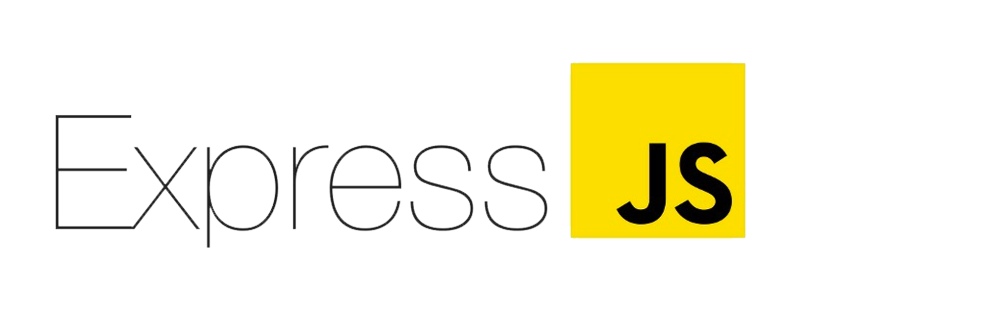

___

___

 

## Table of Contents
* [General info](#exam-management-system)
    - [Sub-Systems](#Sub-systems)
* [Frameworks](#frameworks---fevn)
    - [FEVN-Firestore](#firestore)
    - [Express](#express)
    - [Vue](#vue)
    - [Node](#node)
 

<dl>
  This gets indented, without enumeration nor dots.
</dl>

 

# Exam Management System

&nbsp;&nbsp;&nbsp;&nbsp;&nbsp;&nbsp;*An exam management system is a software tool that helps educators and administrators manage the process of administering exams, grading exams, and tracking student progress. The system typically includes features such as scheduling exams, proctoring exams, grading exams, and managing course materials. Exam management systems can be used in a variety of educational settings, including schools, universities, and professional certification programs.*

&nbsp;&nbsp;&nbsp;&nbsp;&nbsp;&nbsp;*In addition to managing the administrative aspects of exams, an exam management system can also provide students with important information about their exam schedules and results, as well as resources such as study materials and practice exams. Some exam management systems may also include features such as analytics and reporting tools, which can help educators track student progress and identify areas for improvement. Overall, the purpose of an exam management system is to streamline the process of administering and grading exams, and to provide students with the information and resources they need to succeed.*
    
## Sub-systems
    
* Student registration:
    
&nbsp;&nbsp;&nbsp;&nbsp;&nbsp;&nbsp;*This subsystem allows students to create accounts and register for exams. It includes features such as login and password recovery, as well as the ability to update personal information and view exam schedules.*
    
* Exam scheduling:
    
&nbsp;&nbsp;&nbsp;&nbsp;&nbsp;&nbsp;*This subsystem enables administrators to schedule exams, including setting the date, time, and location of the exam, as well as the number of seats available. It might also include the ability to schedule make-up exams or reschedule exams that are cancelled due to unforeseen circumstances.*
    
* Exam proctoring:
    
&nbsp;&nbsp;&nbsp;&nbsp;&nbsp;&nbsp;*This subsystem handles the logistics of administering the exam, including assigning proctors and coordinating the distribution of exam materials. It might also include features such as monitoring tools to ensure the integrity of the exam.*
    
* Grading:
    
&nbsp;&nbsp;&nbsp;&nbsp;&nbsp;&nbsp;*This subsystem handles the process of grading exams and recording the results. It might include features such as the ability to input and manage grades, generate reports on exam performance, and calculate overall grades or course completion rates.*

* Course management:
    
&nbsp;&nbsp;&nbsp;&nbsp;&nbsp;&nbsp;*This subsystem allows administrators to create and manage courses, including setting course prerequisites and requirements, and enrolling students in courses. It might also include features such as the ability to create and manage course materials, such as syllabi, lectures, and assignments.*
 
* Notification and communication:
    
&nbsp;&nbsp;&nbsp;&nbsp;&nbsp;&nbsp;*This subsystem handles communication between students, instructors, and administrators, including sending out notifications about exam schedules, grading results, and other important updates. It might include features such as email or SMS notifications, as well as a messaging system for more direct communication.* 

* Security and access control:
 
&nbsp;&nbsp;&nbsp;&nbsp;&nbsp;&nbsp;*This subsystem handles the security of the exam management system, including managing user accounts and permissions, and implementing measures to prevent unauthorized access or tampering with exam data.*
    

 

# Frameworks - FEVN

### 
Firestore 

    

    
  * *FEVN-Firestore is a cloud-based NoSQL database service provided by Google Cloud Platform. It is designed to store and retrieve large amounts of data quickly and efficiently, and is often used in applications that require real-time data synchronization and offline support. FEVN-Firestore is a part of the Google Firebase suite of tools and services, and can be easily integrated with other Firebase products such as Cloud Functions and Cloud Storage.*
   

   

### Express 
    

    
  * *Express is a web application framework for Node.js that provides a set of features and functionality to build web applications and APIs. It is designed to be flexible and lightweight, and is often used in conjunction with other Node.js modules and libraries to build robust and scalable web applications. Express provides features such as routing, middleware support, and template rendering, and is widely used in the development of server-side applications.*

  

    
### Vue  

  * *Vue is a progressive JavaScript framework for building user interfaces. It is designed to be easy to use and learn, and focuses on providing a smooth developer experience and a high-performance runtime. Vue is often used for building single-page applications and web components, and is known for its reactive data binding and efficient rendering capabilities.*

  

  
### Node  

  * *Node.js is a JavaScript runtime built on Chrome's V8 JavaScript engine. It is designed to be lightweight and efficient, and is often used for building server-side applications and command-line tools. Node.js uses an event-driven, non-blocking I/O model, which makes it well-suited for real-time applications that require high performance and scalability. Node.js is widely used in the development of web servers, APIs, and microservices.*

  
